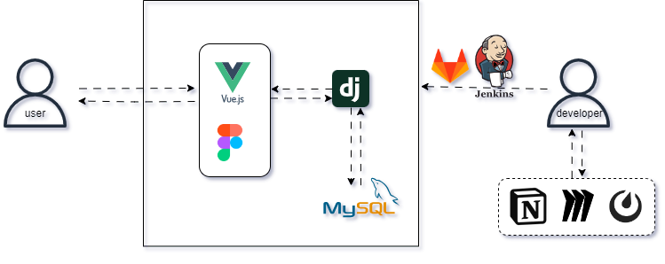
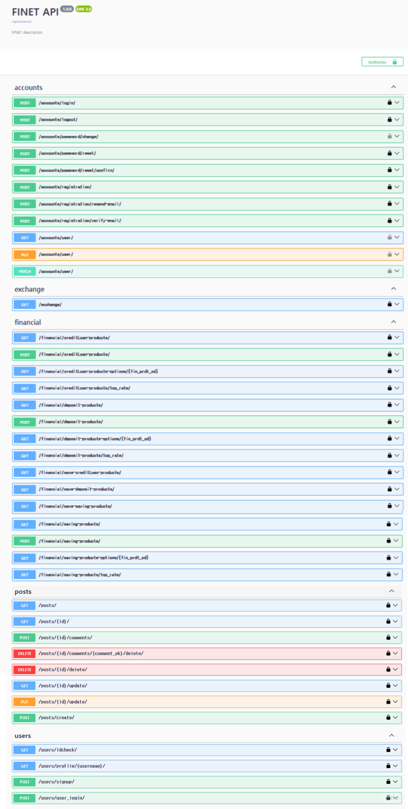
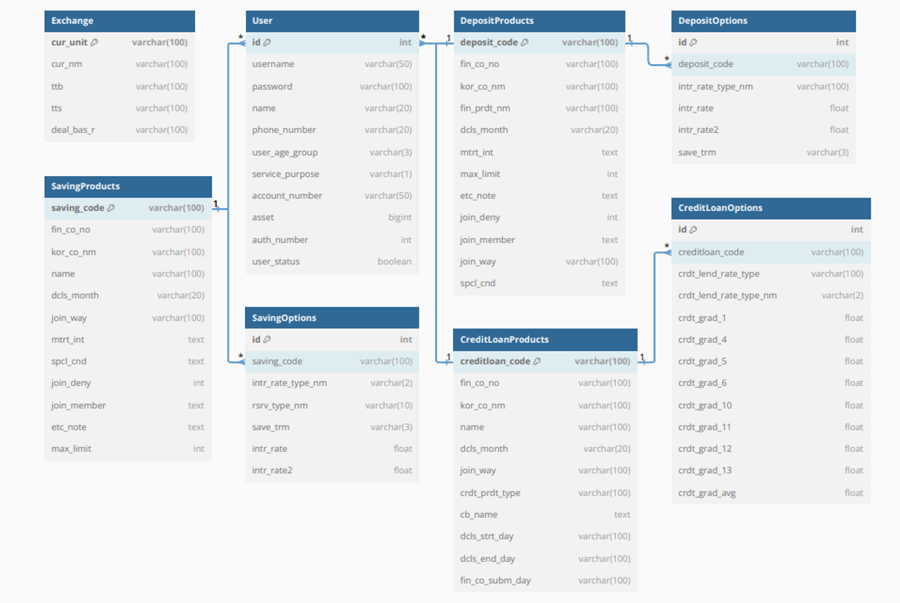

# FINET Project 

FINET = Finance + Network

FINET은 Finance와 Network의 합성어로, 분산되어 있는 다양한 금융 상품 정보와 맞춤 솔루션을 제공하는 네트워크로서, 사용자들에게 최선의 의사결정을 내릴 수 있도록 돕는 종합금융서비스 플랫폼입니다.

### 문제 인식

1. 분산된 금융 정보
   - 다중은행 사용자가 원하는 조건의 금융상품을 찾기 위해 각각의 은행 웹사이트나 지점에서 개별적으로 확인해야 하는 문제가 있습니다.
2. 개별화된 금융 서비스 부족
   - 현재의 금융 상품 추천은 사용자의 개별 재정 상황과 목표를 충분히 반영하지 못해, 일반적이고 일률적인 추천이 대부분입니다.

### 프로젝트 목표

1. 금융 정보 접근성 향상
   - 주요 6대 은행의 예적금, 대출 상품 통합 조회 기능 개발
   - 실시간 환율 조회 기능 추가
   - 지역별 은행 지점 찾기 기능 추가
   - 사용자 의사결정 근거 마련을 위한 상품 후기 게시판 기능 추가
2. 개인 맞춤형 금융 솔루션 제안
   - 연령대, 자산 수준에 따른 상품별 추천 알고리즘 제공
   - 채팅봇을 활용하여 맞춤형 상품 추천 가능

## 주요 기능

1. **시중은행 통합상품 조회**
   - 정기예금, 정기적금, 신용대출 등 시중 은행의 다양한 금융상품을 통합하여 조회할 수 있습니다.

2. **금융상품 가입기간 별 금리 그래프**
   - 가입 기간에 따른 금융상품의 금리를 그래프로 시각화하여 비교할 수 있습니다.

3. **사용자 선택 상품들 금리 비교**
   - 사용자가 선택한 여러 금융상품의 금리를 비교하여 최적의 상품을 선택할 수 있습니다.

4. **국가별 환율 조회 및 환전 계산기**
   - 다양한 국가의 환율을 실시간으로 조회하고 환전 계산을 할 수 있는 기능을 제공합니다.

5. **상품 후기 게시판**
   - 사용자들이 금융상품에 대한 후기를 공유하고 읽을 수 있는 게시판을 제공합니다.

6. **지역별 은행지점 조회**
   - 사용자가 위치를 선택하여 해당 지역의 은행 지점을 조회할 수 있는 기능을 제공합니다.

7. **서비스 자체 추천상품 정보 제공**
   - 사용자의 프로필과 선호도를 기반으로 한 맞춤형 추천 상품을 제공합니다.

## 팀 구성

- **김진기** : 팀장, 백엔드(데이터 처리 및 서버관리)
- **장유진** : 팀원, 프론트(화면 구성 및 웹 동작)

## 개발 타임라인

- **개발기간** : 2024-05-01 ~ 2024-05-23

## 아키텍처

## 개발 환경 & 사용 기술

### Backend

- **Django REST framework** : 웹 API 개발을 위한 프레임워크
- **MySQL** : 데이터베이스

### Frontend

- **Vue.js 3** : 웹 애플리케이션의 사용자 인터페이스를 구축하기 위한 프레임워크
- **Pinia** : Vue.js 애플리케이션의 상태 관리를 위한 상태 관리 라이브러리
- **Axios** : HTTP 요청을 처리하기 위한 라이브러리

### 협업 도구

- **Notion** : 프로젝트 관리 및 문서 공유
- **Mattermost** : 팀 간의 실시간 소통과 메시징

### CI/CD

- **Jenkins** : 지속적 통합 및 배포를 위한 자동화 도구

### 버전 관리

- **GitHub** : 소스 코드 관리 및 협업

## API 명세

## 기능명세서

## ERD 다이어그램
